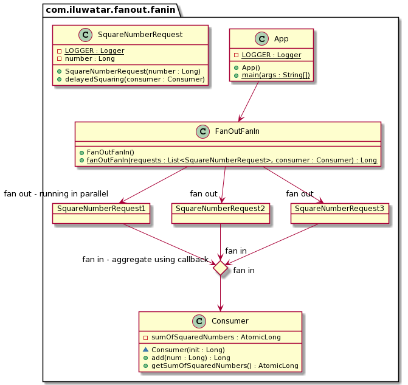

## Intent
The pattern that refers to executing multiple instances of the activity function concurrently. Generally "FanOut" 
process is splitting the data into multiple chunks that would be passed to the activity function. "FanIn" process is 
basically aggregating the result from individual instance of activity function and forming a single final result.  

Each activity function is a long-running process that takes in a chunk of data. A callback function, or a Consumer 
is passed to the activity function, that will be called when the long-running process gets over. The consumer will 
process the individual return value from activity function as they are done running into a final result.

## Class diagram

## Applicability

Use this pattern when you can chunk the workload or load into multiple chunks that can be dealt with separately.

## Credits

* [Understanding Azure Durable Functions - Part 8: The Fan Out/Fan In Pattern](http://dontcodetired.com/blog/post/Understanding-Azure-Durable-Functions-Part-8-The-Fan-OutFan-In-Pattern)
* [Fan-out/fan-in scenario in Durable Functions - Cloud backup example](https://docs.microsoft.com/en-us/azure/azure-functions/durable/durable-functions-cloud-backup)
* [Understanding the Fan-Out/Fan-In API Integration Pattern](https://dzone.com/articles/understanding-the-fan-out-fan-in-api-integration-p)